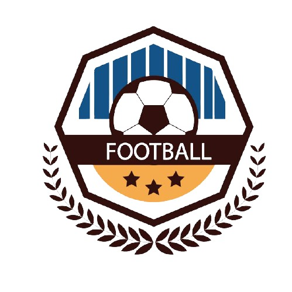

# Soccer Zone Project
---
[**SITE**](https://soccer-zone.herokuapp.com/) Demo

The best result about your games 

## About
---
Webpage developed as a project for the second module of Wrb Development bootcamp at Ironhack.

We had the initial idea to build something that would be useful not only for learning but also something that we could keep in development, adding features.

The project is based on 4 pages where we will have some data about Brazilian and South American soccer championships. In the Campeonato brasileiro tab, we will have information about the clubs and their respective scores, as well as the next game, repeating itself in the tabs of the Copa do Brasil, Libertadores da América and Copa Sul Americana.

Any questions or suggestions, a form will be available in the contacts tab, and the source code will be available on github.

## Development 
---
Page developed in REACT using the [API FUTEBOL]( https://www.api-futebol.com.br/)

##### Libraries used

- [Styled-components](https://styled-components.com/)
- [EmailJS](https://www.emailjs.com/)
- [Material-UI](https://material-ui.com/)
- [React-bootstrap](https://react-bootstrap.github.io/)
- [React-content-loader](https://www.npmjs.com/package/react-content-loader)